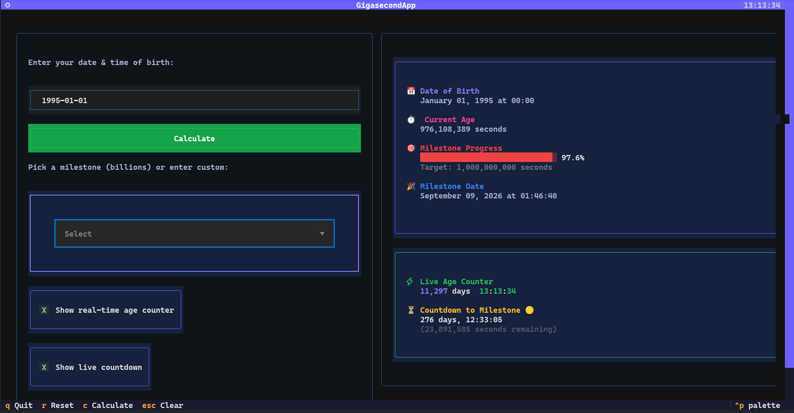

# gigasecond

Ever wondered when you'll hit your billionth second of life?

**gigasecond** is a playful Python tool that calculates exactly how many seconds you've been alive and counts down to your epic billion-second milestone. Just a silly project so you can celebrate your gigasecond.

Built using Textual 6.7.1, this application features:

- Real-time age counter (updates every second)
- Live countdown to milestone (1B, 2B, 3B, or custom)
- Multiple milestone calculator
- Clean, responsive layout with Textual widgets



## What's a Gigasecond?

A gigasecond is exactly 1,000,000,000 seconds - or about 31.7 years. It's that magical moment when your life's clock hits ten digits!

## Installation

1. Install Python (>= 3.10 recommended)
2. Create virtual environment and activate it

   ```bash
    python -m venv venv
    source ./venv/bin/activate
   ```

3. Install dependencies

   ```bash
   pip install textual-dev
   ```

4. Run the application
   ```bash
    cd src
    python -m gigasecond.app
   ```

## Contributing

Found a bug or have a fun feature idea? Pull requests are welcome!

## License

MIT License. See LICENSE file.
